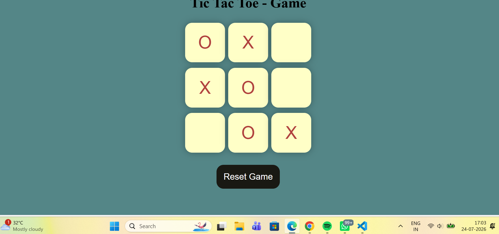

# 🎮 Tic Tac Toe Game

A simple and interactive Tic Tac Toe game built using **HTML, CSS, and JavaScript**.

## 🚀 Live Demo
(Add your GitHub Pages link here after deployment)

## 📌 Features

- Two-player gameplay (X vs O)
- Winner detection
- Draw detection
- Reset Game functionality
- New Game option
- Responsive user interface

## 🛠️ Technologies Used

- HTML5
- CSS3
- JavaScript (ES6)

## 📂 Project Structure

```
Tic-Tac-Toe-Game
│── Index.html
│── style.css
│── app.js
│── README.md
```

## 📸 Screenshot


## 👨‍💻 Author

**Durgesh Maheshwari**

GitHub: https://github.com/DurgeshMaheshwari
